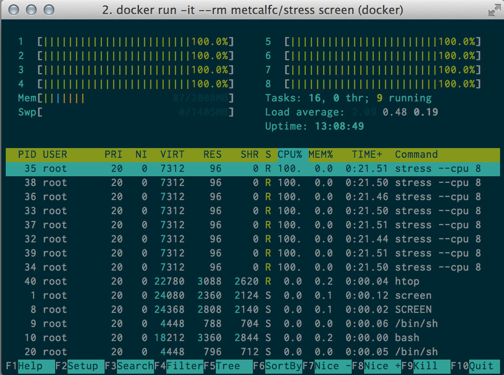
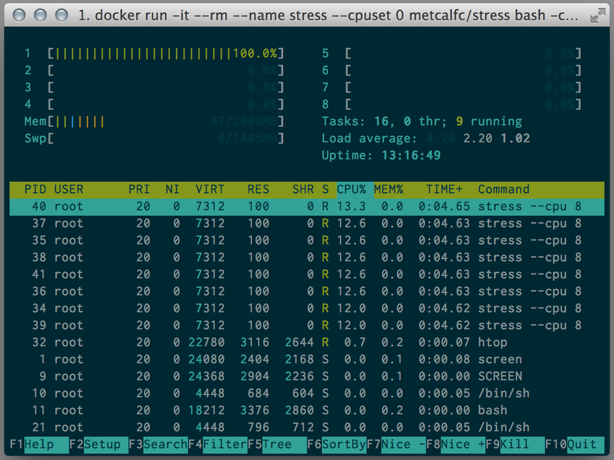
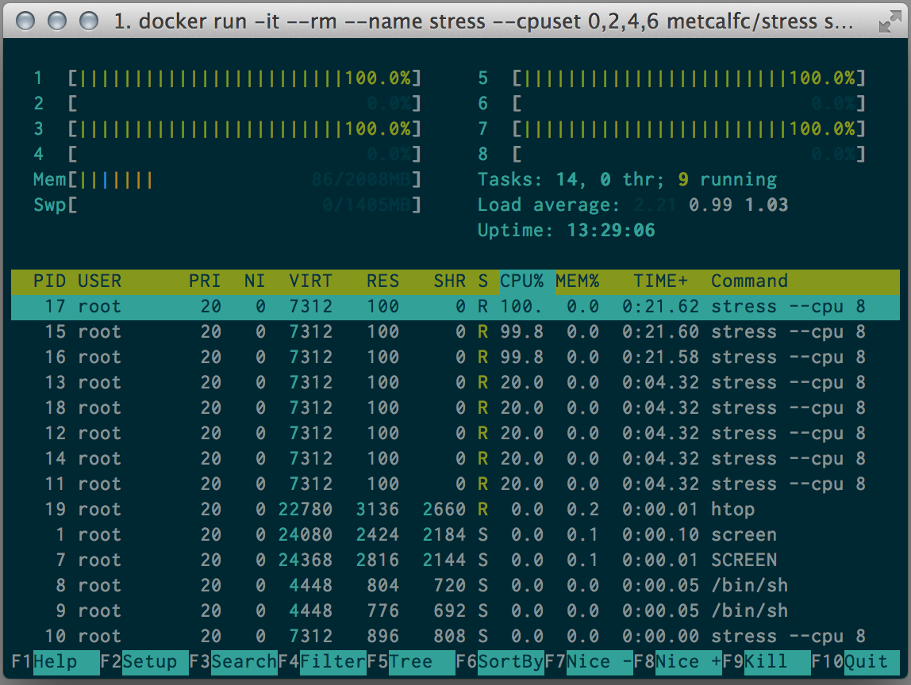
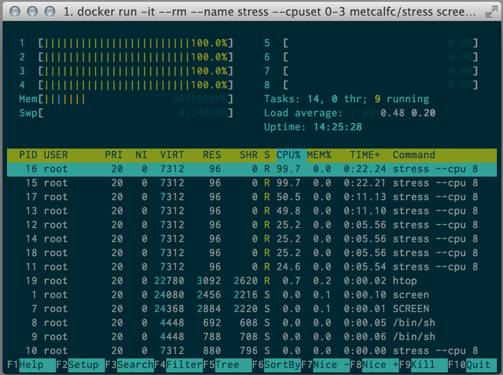

# Using cpuset with a Docker container

By default a Docker container has access to all of the resources of the host (cpu, memory, etc). 

This might not be what you had in mind. So you can use cgroup functionality to limit or pin your container to specific CPUs. cpusets can be single CPUs (1), sets (1,3,5,7)or ranges (0-3). Note that CPUs are counted starting at zero.

To demonstrate this I wrote a quick [`Dockerfile`](./Dockerfile) that installs `stress` and `htop`. `stress` is a clever little application that consumes resources (CPU, memory, IO, etc).

So if we tell Docker to just use `0` when we run `stress --cpu 8` we only load the one CPU.

So if we tell Docker to just use `1,3,5,7` when we run `stress --cpu 8` we only load the 4 CPUs.

Same thing goes for using `0-3`.

